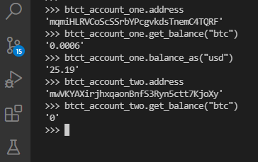
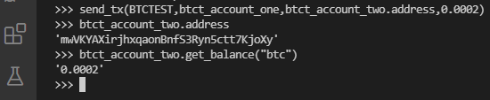
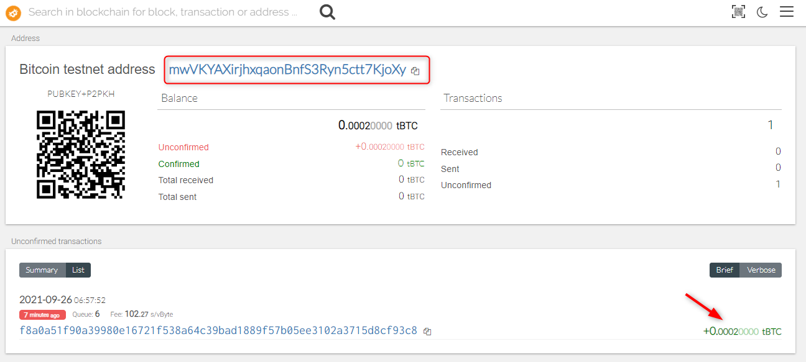
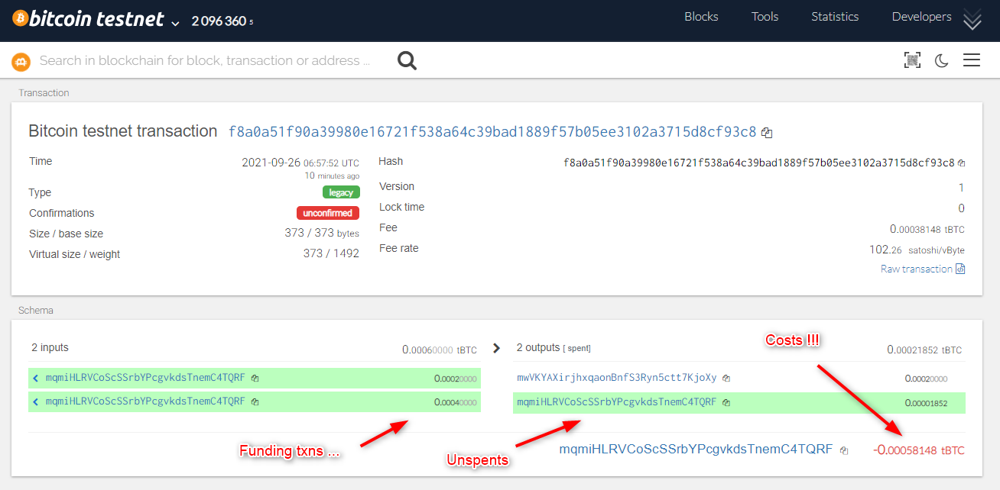
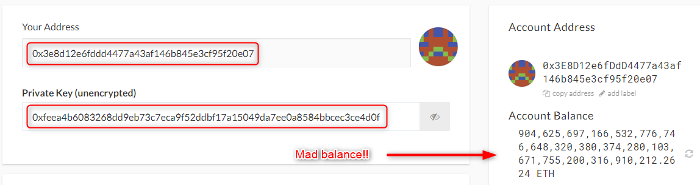
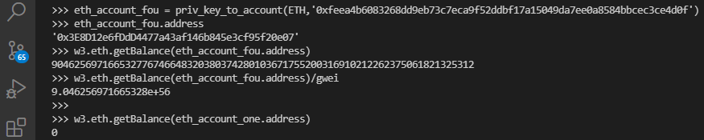
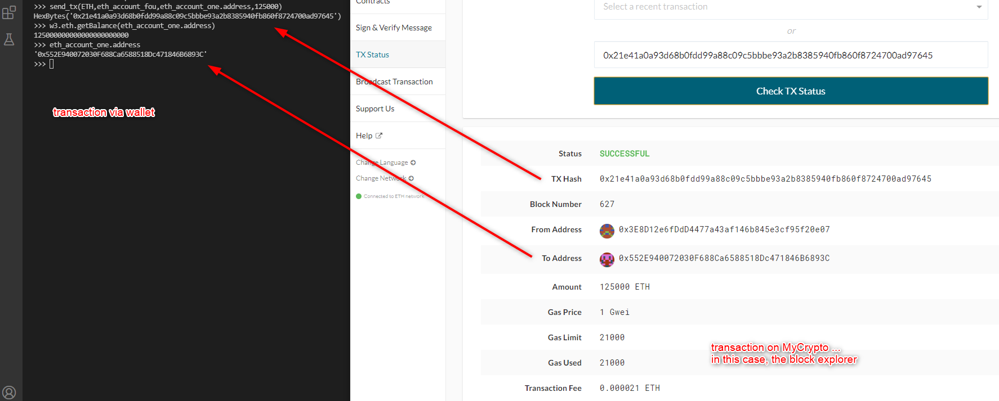
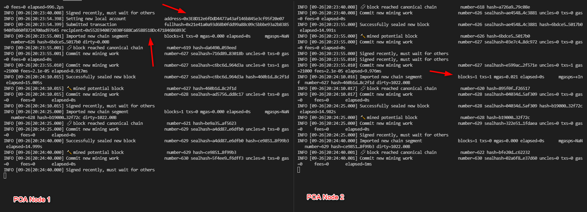

# blockchain-wallet
This repository contains python-based code which creates and manages a crypto wallet. The wallet supports both BTC and ETH-based addresses.  I will show some test transactions and run through some steps demonstrating this ... continue reading.

# Py-thollet
Silly title, but explains what I've built :) ... a Python Crypto Wallet! Yee ha!

## Intro
What follows is partly a demonstration and set of instructions for you to do the same.

### Installing Dependencies

> Note:  You can use whichever IDE you prefer.  Whichever it is, the following will be required.  
> If Anaconda is used, Python 3.7 is recommended  
```
conda create -n <your-env-name-here> python=3.7 anaconda
conda activate ethereum
```

**Web3**  
Web3 is an awesome library for interacting with an Ethereum blockchain (local, test or mainnet) and used within this wallet and demo; find out more [here](https://web3py.readthedocs.io/en/stable/).  
Use `pip install` to download and install `web3.py` -:  
```
pip install web3
```

**Bit**  
Bit is the Bitcoin equivalent and used for compatible blockchains as well as it having implemented a number of Bitcoin Improvement Protocols (BIP).  Find out more [here](https://ofek.dev/bit/guide/intro.html).  
Use `pip install` to download and install `bit`: -  
```
pip install bit
```


### Wallet Setup
As part of this project, I use hd-wallet-derive.  What is it?  Well, from dan-da's [GitHub repo](https://github.com/dan-da/hd-wallet-derive), "hd-wallet-derive is a command-line tool that derives bip32 addresses and private keys for Bitcoin and many altcoins."  
It is very easy to use, but requires that PHP is installed.  There are other versions of it and perhaps you'd prefer to use those, e.g. JavaScript, Go, etc.; find them on the web.

> Note: hd-wallet-derive is included in this repo, along with a symbolic link, `derive` which "points" to the main executable `./hd-wallet-derive/hd-wallet-derive.php`

In order to install hd-wallet-derive, `cd` to `wallet` and: -  

**For Windows**  
** *Make sure you've started your `bash` terminal as Administrator, i.e. run as admin from the launch menu*
```
git clone https://github.com/dan-da/hd-wallet-derive
cd hd-wallet-derive
curl https://getcomposer.org/installer -o installer.php
php installer.php
php composer.phar install
```

**For Mac**  
We don't have Apple products in this company :)  

**Confirm Install**  
Execute the following brief "test" and if installed successfully, you should see the output: -  
```
./hd-wallet-derive.php --key=xprv9zbB6Xchu2zRkf6jSEnH9vuy7tpBuq2njDRr9efSGBXSYr1QtN8QHRur28QLQvKRqFThCxopdS1UD61a5q6jGyuJPGLDV9XfYHQto72DAE8 --cols=path,address --coin=ZEC --numderive=3 -g

+------+-------------------------------------+
| path | address                             |
+------+-------------------------------------+
| m/0  | t1V1Qp41kbHn159hvVXZL5M1MmVDRe6EdpA |
| m/1  | t1Tw6iqFY1g9dKeAqPDAncaUjha8cn9SZqX |
| m/2  | t1VGTPzBSSYd27GF8p9rGKGdFuWekKRhug4 |
+------+-------------------------------------+
```

**Wallet Mnemonic**
A mnemonic phrase is required in order to generate the keys, hash and addresses for the wallet and is not transparent in the demo.  The mnemonic needs to be created and stored within the `.env` file which is included in this repository.  It is recommended that one generates their own mnemoonic phrase and replace the default value provided, e.g. `mnemonic="blah blah fishpaste"`, with that generated as is demonstrated here, taking the 24 words within the quotes below and replacing the default within `.env` with them.

```
./derive --gen-key --format=jsonpretty -g | grep mnemonic | head -1

"mnemonic": "minor orchard cover panic firm badge sentence raw consider clip kid network parade demand border have extra burden staff capital lake stuff grass pulp",
```

**hd-wallet-derive example**
A useful utility within hd-wallet-derive is showing what coins are currently available, for which keys, address, etc. can be derived.  
Use this command (from the `wallet` dir.) to see which are support, e.g. MOON or moon(case-insensitive):
```
./derive --help-coins | grep -i moon

| MOON          | Mooncoin - Mainnet                 |       |
| MOON-test     | Mooncoin - Testnet                 |     1 |
| MOON-regtest  | Mooncoin - Regtest                 |     1 |
```  

### What does the Wallet do?
**THIS WALLET IS FOR USE WITH TEST-NETS ONLY**  
What this wallet allows one to do, is to store public keys, private keys and addresses for any of the myriad of Ethereum and Bitcoin-compatible chains.  As shown in the section immediately preciding this one, these are generated using `hd-wallet-derive` and the list of those available can be determined as above.

The wallet currently allows for: -
- the derivation and storing (in memory) of keys and addresses for, as has been mentioned, Bitcoin or Ethereum only (more are possible in future)
- the creation of transactions and sending of BTC or ETH from one address to another address.

A demo of how it can be used follows ...

## Transaction Demos
In order to get started, make sure you're in the `wallet` directory and then fire up a Python shell: -

```
cd wallet
python
```  

### Getting Started
Within the Python shell, run: `from wallet import *` which will allow you to follow along.

```
$ python
Python 3.7.10 (default, Feb 26 2021, 13:06:18) [MSC v.1916 64 bit (AMD64)] :: Anaconda, Inc. on win32
Type "help", "copyright", "credits" or "license" for more information.
>>> from wallet import *
>>>
```

### Creating Accounts

As an example of how to create an account, I can show you a quick comparison of the addresses that are created by default by hd-wallet-derive upon initiating wallet with python as you have done above.  
The wallet creates 3 addresses by default.  One can change this, by changing the value of `numderive` within `constants.py`.  
So, using the following notation, one can extract the specific details for each set of keys, the first of which starts with `0`, the next being `1`, the next `2`, etc.  In this case, as `numderive` is 3 be default, there will be no value `3`.

**Ethereum**  
One can extract the address from the `coins` dictionary manually.  There is no need to extract everything manually; this is a demonstration of what is available within the dictionary:
```
>>> coins[ETH][0]['address']
'0x552E940072030F688Ca6588518Dc471846B6893C'
```

One can create an account, e.g. `eth_account_one` which is an object specific to the blockchain library as (described above), in this case ETH.  Note: the address is identical to that shown above, but now accessible within the object.  

```
>>> eth_account_one = priv_key_to_account(ETH,coins[ETH][0]['privkey'])
>>> eth_account_one.address
'0x552E940072030F688Ca6588518Dc471846B6893C'
```

**Bitcoin**  
The same is true for Bitcoin.  Note, the address is chain-specific:  

```
>>> btct_account_one = priv_key_to_account(BTCTEST,coins[BTCTEST][0]['privkey'])
>>> btct_account_one.address
'mqmiHLRVCoScSSrbYPcgvkdsTnemC4TQRF'
```
---
## Sending some CA$H
### **Bitcoin** Preparation
In order to demonstrate the sending of some transactions between the two accounts as created above, we need some funds.  I have pre-funded `btct_account_one` with some funds from a test faucet (learn about faucets [here](https://en.bitcoin.it/wiki/Testnet) if you're not familiar with them).  

Checking the balance of them both:  

  

Now that we've established "Account One" has been funded with some test cash, lets send BTC to "Account Two".  

The function's usage is `send_tx(coin, account, to_address, amount)`, where:-  

> `coin` is the relevant coin/chain, e.g. BTC or BTCTEST or ETH  
> `account` is the account which has the address *with funds*  
> `to_address` is the address to which the funds are to be sent  

Sending some of the balance of '0006' tBTC, i.e. '0002' tBTC to "Address Two":  

  

X

### **Bitcoin** Transaction Exploration
I have used the Bitcoin Testnet explorer available [here](https://tbtc.bitaps.com/), to show the transaction as demonstrated above.

Checking the Bitcoin Explorer for "Account Two", we see the transaction of '0002' coming through for the 2nd account's address (mwVKYAXirjhxqaonBnfS3Ryn5ctt7KjoXy): -

  

Looking at the transaction itself, we can see that the fee was rather high and does not leave much available for "account one" as well as the transactions that funded the original address from the testnet faucet: -

  


### **Ethereum** Preparation
The example for Ethereum is much the same, but a different network is used, along with a different blockchain explorer.  
To prepare for this demo, I need to prepare things a little differently.  In terms of funding the test-addresses, this has already been done with an Ethereum Proof of Authority (PoA) network set up in a separate project.  Please see the following repository for how that was set up: https://github.com/aylwarda/blockchain-homework

Checking that accounts are funded:
> Note: the address and private key

  

Using `wallet`, I add this address as an object which I can use as part of this demo.  I do that by executing `eth_account_fou = priv_key_to_account(ETH,<private-key-here>)`.  "Account Four" is created, as previously explained, 3 accounts are populated within the `coins` dictionary object, so this is the fourth.  
> Note: the addresses are checked ... one with ***a lot*** of test-ETH and the other with 0 ETH.

  

### **Ethereum** Transaction Exploration
Now, for the actual transaction.  Using `wallet` I send 125000 ETH to "Account One" which has been newly created as part of this demo, and this has been done from an account which already existed as part of an older project, i.e. "Account Four" created above.
> Note: the transaction hash, address, amount.  
> Note also, that using MyCrypto as the blockchain explorer and searching on the transaction, the details are shown as expected.  

  

> Note: the transaction being mined as can be seen in the logs as captured.  
> Note too, that the transaction hash and address are as above.  

  

## Booyakasha!
With that, I hope the demo of `wallet.py` has met with your expectations :)

### To do
There are a number of additions to this project that would help with making it better; some ideas are: -
- Persisting the addresses for all requested coins automatically
- Include encryption for that persistence
- Adding support beyond just ETH and BTC
- Adding get_balance for ETH and include the converstion from gwei to ETH.

# Acknowledgements and References
- For this project, I used the `bit` library as explained above; url [here](https://ofek.dev/bit/guide/intro.html)
- Web3.py has also been used as explained above; similarly, url found [here](https://web3py.readthedocs.io/en/stable/)
- I've also used hd-wallet-derive, including the repository wihin my own.  The instructions as to where to clone hd-wallet-derive and applicable licence info is available [here](https://github.com/dan-da/hd-wallet-derive).
- Trinity College is the organisation that has provided training for accomplishing this demo (as part of a Monash University Bootcamp)
